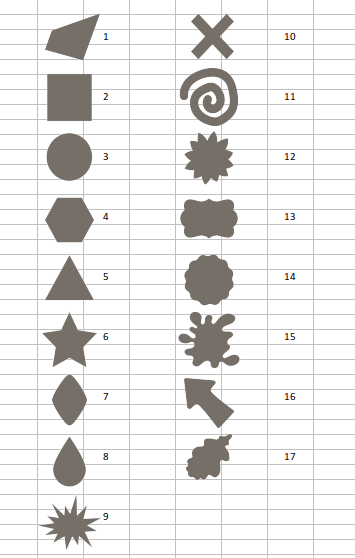

```{r setup, echo=FALSE, error=FALSE, warning=FALSE}
# set global chunk options: images will be 7x5 inches
library(kableExtra)
library(pheatmap)
knitr::opts_chunk$set(fig.width=7, fig.height=5)
options(digits = 4)
```

[Uz sākumu](../index.html)

## Ievads

Daudzdimensiju mērogošana ir paņēmienu kopums, 
kas pārveido galīgu kopu ar uzdotu savstarpējo
*attālumu matricu* (*distance matrix*) 
par punktiem $n$-dimensiju Dekarta telpā. 

Piedāvājam piemēru, kur 17 dažādas figūriņas 
dažādi lietotāji ir novērtējuši septiņās atšķirīgās
emociju skalās (katra skala ir starp divām pretējām emocijām un 
katrs no aptaujātajiem dažām no figūriņām izvēlējās uz 
šīm skalām vērtības no $0$ līdz $100$). 



Šādi izskatījās 7 *slīdņi* (*sliders*) ar emociju 
diapazoniem:


Bija 2 datu faili
`RawData-emotions-shapes.csv` (Aptauja 1) un `RawData-shapes-emotions.csv` (Aptauja 2).


## Vai visas emociju skalas ir vienlīdz "precīzas"?

Atkarībā no figūriņas un pretējo emociju pāra
bija visai atšķirīgas atbilžu izkliedes (standartnovirzes,
ko iegūst, salīdzinot visas atbildes, kurās dažādi 
respondenti piekārtoja tai pašai figūriņai to pašu 
emociju slīdņa vērtību).  

### Pirmā datu kopa

Datu kopā `RawData-emotions-shapes.csv` ir 28 respondentu 
atbildes, kam aptauju sistēmā izveidoti unikāli identifikatori par 222 figūriņām. 
Šeit dota standartnoviržu matrica tām skaitļu virknītēm, kā 
attiecīgo figūriņu (ar numuru no $1$ līdz $17$, izņemot numuru $12$) 
novērtēja attiecībā pret kādu no $7$ emociju skalām. 

```{r, echo=FALSE, error=FALSE, warning=FALSE}
rangeDF1 <- getSDMatrix1()
kable(t(rangeDF1)) %>%
kable_styling("striped", full_width = F) %>%
row_spec(1:7, bold = F, color = "white", background = "#000080") 
```

Zemāk attēlots heatmap-s ar atbilstošajām standartnoviržu vērtībām. 
Zilās rūtiņas atbilst zemai standartnovirzei (konsekventām 
atbildēm no vairākiem respondentiem), sarkanās - augstai 
standartnovirzei (augstai atbilžu izkliedei).
 

```{r heatmap1, echo=FALSE, error=FALSE, warning=FALSE, fig.width=5, fig.height=3, fig.cap='*Attēls: Standartnovirze figūriņas-emocijas pārim no* `RawData-emotions-shapes.csv`'}
rangeDF1 <- getSDMatrix1()
pheatmap(t(rangeDF1), treeheight_row = 0, treeheight_col = 0, cluster_rows=F, cluster_cols=F)
```


### Otrā datu kopa

Failā `RawData-shapes-emotions.csv` atrodamas 29 respondentu atbildes - visi 
kopā viņi izvērtējuši $206$ figūriņas, pierakstot katrai no tām visas 
septiņas emociju skalas.   
Šajā datu kopā trūkst nav figūriņas #12 (margrietiņa), 
nav atbilžu arī par figūriņām
#2 (kvadrāts), #3 (aplis), #4 (sešstūris), #5 (trijstūris).

```{r, echo=FALSE, error=FALSE, warning=FALSE}
rangeDF2 <- getSDMatrix2()
kable(t(rangeDF2)) %>%
kable_styling("striped", full_width = F) %>%
row_spec(1:7, bold = F, color = "white", background = "#000080")
```
Seko heatmap-s ar šiem pašiem skaitļiem:

```{r heatmap2, echo=FALSE, error=FALSE, warning=FALSE, fig.width=4, fig.height=3, fig.cap='*Attēls: Standartnovirze figūriņas-emocijas pārim no* `RawData-shapes-emotions.csv`'}
rangeDF2 <- getSDMatrix2()
pheatmap(t(rangeDF2), treeheight_row = 0, treeheight_col = 0, cluster_rows=F, cluster_cols=F)
```

* Atbildot par to, vai figūriņa #3 (aplis) ir patīkami uztraukta vai mierīga, 
atbilžu standartnovirze bija $\mathit{sd}=17.04$ (mazākā no visām). 
* Atbildot par to, vai figūriņa #11 (spirāle) ir interesanta vai garlaicīga, 
atbilžu standartnovirze bija $\mathit{sd}=40.31$ (lielākā no visām).
* Heatmap-i mums parāda, ka ievadītās atbildes (to izkliede) ir ļoti atkarīgas
no aplūkojamās figūriņas. Par apli (#3), zvaigznīti (#6) un viļņaino aplīti (#14) 
ir diezgan konsekventi emociju skaitļi; 
par spirāli (#11) un par ūdenslāsi (#8) tie ir daudz stiprāk izkliedēti.

No otras puses, nav novērots, ka viena no emociju skalām būtu krietni precīzāka (visām figūriņām)
par kādu citu skalu. Standartnovirzes katrai no septiņām skalām (ja skaita 
rezultātus pa visām figūriņām kopā)
bija robežās $[29;33]$. Tādēļ turpmāk uzskatīsim visu emociju skalu datus par vienlīdz ticamiem 
un precīziem. 
(Ja dažas skalas būtu krietni neprecīzākas par citām, tad rastos jautājums par ievadīto skaitlisko 
atbilžu $a \in [0;100]$ ticamību vai par pašu uzstādīto jautājumu piemērotību 
respondentu spējai uz tiem atbildēt.)


## Vai visas emociju skalas ir savstarpēji "neatkarīgas"?

Ja aplūkojam vidējās vērtības tam kā figūriņu $S_i$ ($i=1,\ldots,17$) novērtēja attiecībā 
pret emociju $E_j$ ($j=1,\ldots,7$), un apzīmējam vidējās atbildes ar $a(i,j)$, 
tad var novērtēt Pīrsona korelācijas koeficientus, salīdzinot 
$a(i,j_1)$ un $a(i,j_2)$ jebkurām divām emociju skalām $E_{j_1}$ un $E_{j_2}$, 
kur $i$ mainās pa visām figūriņām. Augsts korelācijas koeficients nozīmē
to, ka emociju skalas ir līdzīgas (mēra apmēram to pašu par katru doto figūriņu). 


```{r, echo=FALSE, error=FALSE, warning=FALSE, fig.cap='Attēls: Korelācijas starp 7 emociju skalām'}
corMatrix <- getMeanCorMatrix()
kable(t(corMatrix)) %>%
kable_styling("striped", full_width = F) %>%
row_spec(1:7, bold = F, color = "white", background = "#800000") 
```

No matricas redzam, ka, teiksim, emociju skalām $E_2$ (cerīgs-izmisis)
un $E_5$ (apmierināts-aizkaitināts) ir augsts korelācijas koeficients 
$r = 0.95$. Tas nozīmē, ka emociju skaitļa $E_2$ izmaiņa (pārejot no vienas
figūriņas uz citu) izskaidro $r^2$ jeb aptuveni 90%
no emociju skaitļa $E_5$ izmaiņas un otrādi.

Precīzākai salīdzināšanai būtu jāskatās nevis agregētie dati (vidējie
emociju skaitļi pa visiem respondentiem), bet gan 
instanču dati (vai arī atsevišķie respondenti vērtēja skalas $E_2$ un 
$E_5$ ļoti līdzīgi)? Tas šeit nav izdarīts.


## Pirmās datu kopas emociju vērtējumi

Aplūkosim katru no $16$ figūriņām kā "punktu" 7-dimensiju telpā.
(tās ir figūras no $1$ līdz $17$, izņemot #12, par kuru mums nav datu). 
Katra no dimensijām ir skaitlis robežās $[0;100]$ - vidējais 
vērtējums attiecīgajā emociju skalā. 
Piemēram, 1.figūriņai (taisnleņķa trapece) atbilst šādas koordinātes:
$$S_1 = (51.46, 46.03, 40.34, 60.51, 51.91, 42.26, 60.09).$$


```{r, echo=FALSE, error=FALSE, warning=FALSE}
meanMatrix <- getMeanMatrix1()
kable(t(meanMatrix)) %>%
kable_styling("striped", full_width = F) %>%
row_spec(1:7, bold = F, color = "black", background = "#FFFFFF")
```

Tās emociju "dimensijas", kuras ir pārāk stipri korelētas ar citām, iespējams, 
vajadzētu aplūkot ar samazinātu svaru 
(piemēram, "apmierināts-aizkaitināts" un "cerīgs-izmisis"). 
Tomēr, vienkāršības dēļ uzskatīsim visas tās par vienlīdzīgām un 
definēsim starp figūriņām parasto Eiklīda attālumu $7$-dimensiju telpā. 
Piemēram, attālums starp #1 (trapeci) un #2 (kvadrātu) izsakāms
šādi:
$$d(S_1,S_2) = \sqrt{(51.46-58.71)^2 + \ldots + (60.09 - 69.21)^2} = 33.$$

Attēlosim savstarpējos figūriņu attālumus $16 \times 16$ matricā:

```{r, echo=FALSE, error=FALSE, warning=FALSE}
distances <- getDistanceMatrix()
kable(distances) %>%
kable_styling("striped", full_width = F) %>%
row_spec(1:16, bold = F, color = "white", background = "#008000")
```


```{r MDSscatter, echo=FALSE, error=FALSE, warning=FALSE, fig.width=6, fig.height=6, fig.cap='*Attēls: MDS 16 figūriņām (pirmā datu kopa)*'}
dist.sh <- getDistanceMatrix()
fit <- cmdscale(dist.sh, eig = TRUE, k = 2)
x <- fit$points[, 1]
y <- fit$points[, 2]
plot(x, y, pch = 19, xlim=c(-60,60), ylim=c(-40,40))
sh.names <- paste0("S",c(1:11,13:17))
ppos <- rep(4, times=16)
ppos[14] <- 1
text(x, y, pos = ppos, labels = sh.names)
grid()
```

Interpretēt šo zīmējumu ir grūti, kamēr mēs nezinām, kādu nozīmi aptaujātie
piedēvēja dažādajām emociju skalām. Mēs, piemēram, varam pateikt, 
ka attālums $d(S_3, S_11) = 80.97$ (attālums starp apli 
un spirāli) ir viens no lielākajiem visā attālumu tabulā, tādēļ 
arī "iebāžot" 7-dimensiju telpu 2-dimensiju telpā, atbilstošie
punkti $S_3$ un $S_{11}$ būs pietiekami tālu viens no otra - 
tie ir divi galējie punkti uz "ziemeļrietumu-dienvidaustrumu" ass. 

Bet citu punktu interpretācija jau vairs nav tik skaidra. 
Piemēram $S_{17}$ (ozollapa) pēc 7-dimensiju Eiklīda attāluma
ir ļoti tuvu $S_3$ (aplim); savukārt $S_{15}$ (kleksis) 
ir ļoti tuvu $S_{11}$ (spirālei). 


## Pārbaude ar Otro Datu kopu

Otrā datu kopa (failā `RawData-emotions-shapes.csv`)
nesatur vēl $4$ figūriņas ($S_2$, $S_3$, 
$S_4$, $S_5$), bet daudzas figūriņas sakrīt ar pirmo datu kopu
(failā `RawData-shapes-emotions.csv`).
Lai saprastu, cik "objektīvi" ir figūriņu attālumi, 
kas iegūti ar daudzdimensiju mērogošanu (MDS), pārnesot
7 emociju dimensijas 2-dimensiju plaknē. 


Attēlosim savstarpējos figūriņu attālumus $12 \times 12$ matricā:

```{r, echo=FALSE, error=FALSE, warning=FALSE}
distances <- getDistanceMatrix2()
kable(distances) %>%
kable_styling("striped", full_width = F) %>%
row_spec(1:12, bold = F, color = "white", background = "#008000")
```

Šo attālumu matricu cenšoties (ar minimālām deformācijām) 
ievietot 2D telpā, iegūstam šādu daudzdimensiju mērogošanas attēlu:


```{r MDSscatter2, echo=FALSE, error=FALSE, warning=FALSE, fig.width=6, fig.height=6, fig.cap='*Attēls: MDS 16 figūriņām (otrā datu kopa)*'}
dist.sh <- getDistanceMatrix2()
fit <- cmdscale(dist.sh, eig = TRUE, k = 2)
x <- -fit$points[, 1]
y <- -fit$points[, 2]
plot(x, y, pch = 19, xlim=c(-60,60), ylim=c(-50,50))
sh.names2 <- paste0("S",c(1, 6:11,13:17))
ppos <- rep(4, times=12)
text(x, y, pos = ppos, labels = sh.names2)
grid()
```

Kā redzams, datiem piemīt dažas likumsakarības, kas
sakrīt pirmajā un otrajā datu kopā. Arī šajā attēlā
divus galējos stāvokļus ieņem figūriņas $S_{14}$ (aplītis
ar viļņainu maliņu) un $S_{10}$ (slīps krustiņš). 
Savukārt uz otras diagonāles pretējos stūros ir attēli
$S_{17}$ (ozollapa) un $S_{11}/S_{15}$ (spirāle un 
kleksis). 


## Citi avoti

* [D3 Diagrammas figūriņām/emocijām](http://bustling-dynamo-253414.appspot.com/).
* [Par daudzdimensiju mērogošanu](https://en.wikipedia.org/wiki/Multidimensional_scaling)
* [Knitr ar Markdown: Lapā izmantotā tehnoloģija](https://yihui.org/knitr/demo/minimal/)


